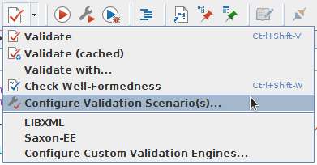
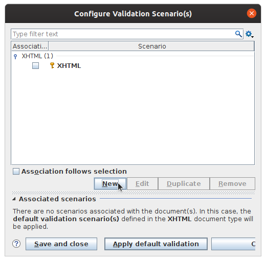
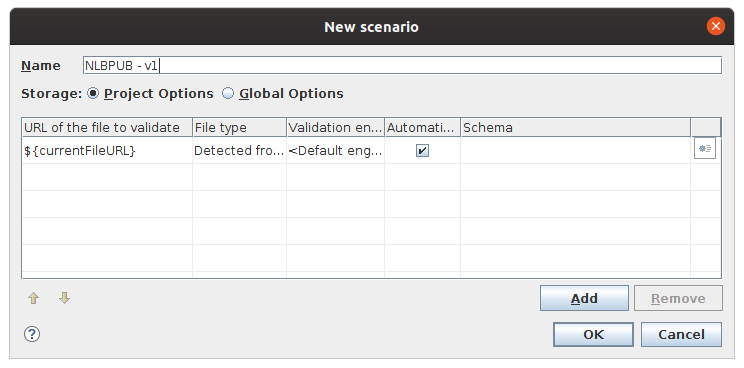
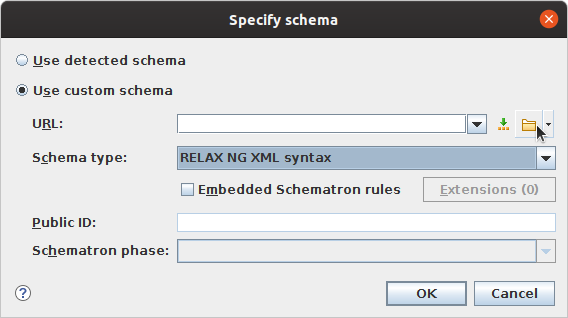
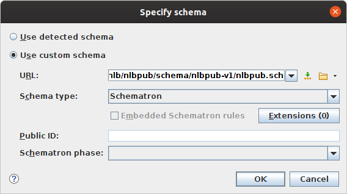
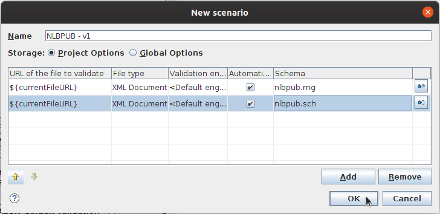
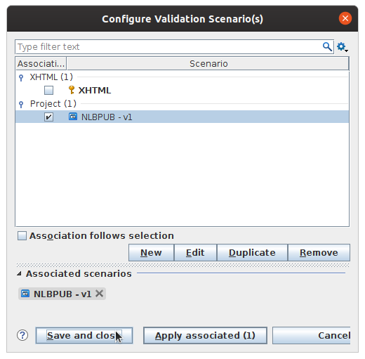
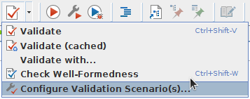
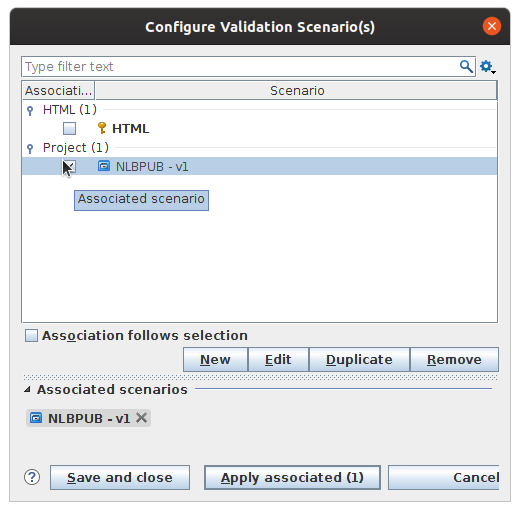

# NLBPUB

NLBPUB er NLBs profil for å produsere universelt utformet EPUB.

Versjoner/revisjoner av skjemareglene finnes i "schema"-mappen.

## schema/revision-2018

Dette er resultatet etter en full gjennomgang av skjemareglene
i 2018. Vi har ikke tatt i bruk disse først og fremst fordi:

- retningslinjene må revideres tilsvarende
- valideringsreglene bør dokumenteres (helst genereres automatisk basert på kildekoden)
- eksisterende bøker må gjøres valide i henhold til disse reglene

## schema/nlbpub-v1

Dette er i praksis de samme reglene som gjelder for "single-html" i de nordiske retningslinjene.
Den eneste forskjellen er at det her ikke kreves et `<header>`-element,
som brukes for å konvertere `<doctitle>` og `<docauthor>` mellom DTBook og HTML/EPUB.

## Oppsett i Oxygen

For å lage et valideringsscenario i Oxygen, som gjør det enklere å validere NLBPUB-HTML-filer i Oxygen, kan du gjøre følgende:

<table>
<tr><td></td>
    <td>Under valideringsknappen på verktøyslinja, velg "Configure Validation Scenario(s)...".</td></tr>
<tr><td></td>
    <td>Trykk på "New" for å lage et nytt scenario.</td></tr>
<tr><td></td>
    <td>Gi det nye scenarioet et navn, for eksempel "NLBPUB - v1". Her er det en tabell med filer som skal brukes til validering. I den første raden, gå inn i "Schema"-cellen for å velge en fil.</td></tr>
<tr><td></td>
    <td>Velg "RELAX NG XML syntax" som "Schema type", og finn fram til filen schema/nlbpub-v1/nlbpub.rng i URL-feltet. Trykk OK.</td></tr>
<tr><td></td>
    <td>Velg "Add" for å legge til en ny rad med en ny fil, og gjør det samme en gang til for å legge til schema/nlbpub-v1/nlbpub.sch, men bruk "Schematron" som "Schema type" denne gangen.</td></tr>
<tr><td></td>
    <td>Du skal nå ha to rader i dette scenarioet, en med nlbpub.rng, og en med nlbpub.sch. Trykk OK.</td></tr>
<tr><td></td>
    <td>Trykk "Save and close" for å gå ut av scenario-konfigurasjonen.</td></tr>
</table>

## Bruk i Oxygen

Når du har åpen en HTML-fil du vil validere i henhold til NLBPUB-reglene, kan du gjøre som følger:

<table>
<tr><td></td>
    <td>Under valideringsknappen på verktøyslinja, velg "Configure Validation Scenario(s)...".</td></tr>
<tr><td></td>
    <td>Huk av for "NLBPUB - v1" i lista over scenarioer, og trykk "Apply associated". HTML-fila du har åpen vil nå bli validert i henhold til NLBPUB-reglene. (Om du gjør endringer i fila og vil validere på nytt kan du trykke på valideringsknappen i verktøyslinja, du trenger ikke åpne "Configure Validation Scenario(s)"-menyen hver gang.)</td></tr>
</table>
